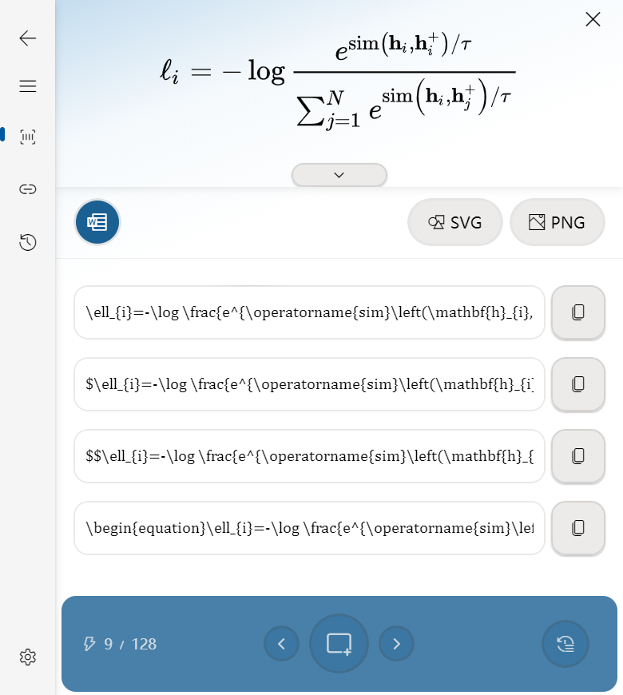
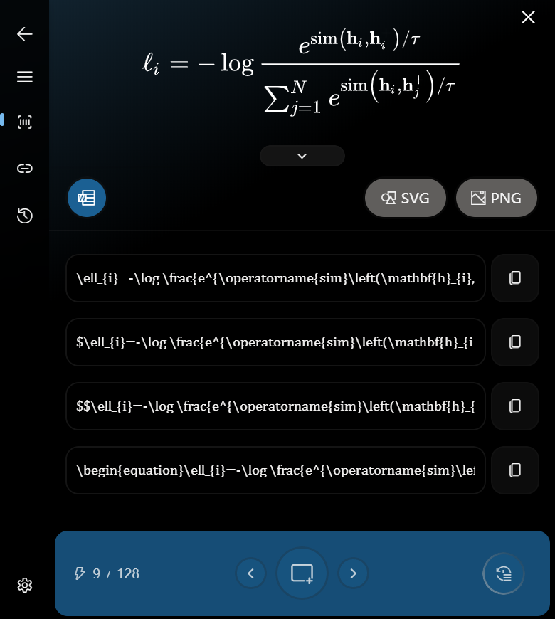
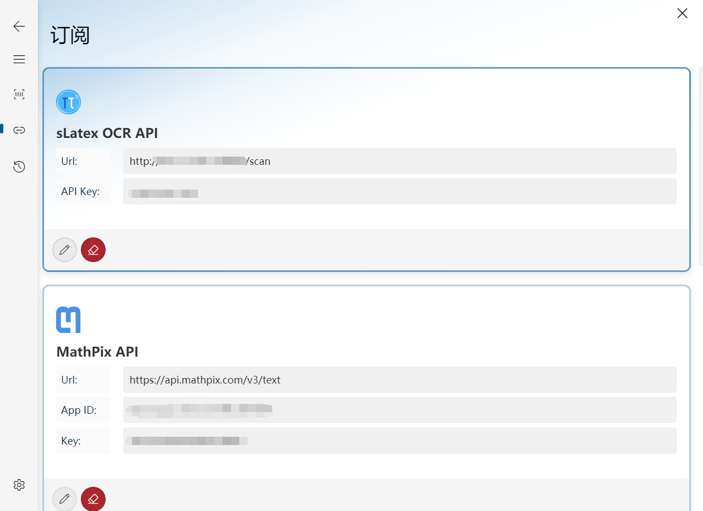

    
    
MathFX

    

    

## 💡 MathFX(Preview)

A pure open source and cross platforms Math Formulates OCR tool based on the Electron.

    
    

## ✨ Installation

See the [Release Page](https://github.com/Creator-SN/MathFX/releases).

## 🔨 Tutorial

First, you need to set up the subscriptions, MathFX currently support three formulate OCR APIs. Incluing:

1. **Mathpix** **(Recommend)**: You can register the OCR API services with `$1` started, and the current pricing is much cheaper than directly using the Mathpix desktop application, each month you can have a `1,000` free requests. (`Although it costs $1 to sign up and a Credit Card is necessary, but the performance of this API is currently the best`).  [See Details](https://mathpix.com/ocr)
2. **Xunfei** Formula Recognition API: You can register the OCR API for free and obtain a `500` requests per day. [See Details](https://www.xfyun.cn/service/formula-discern)
3. **Baidu** Formula Recognition API: You can register the OCR API for free and obtain a `1,000` requests per month. [See Details](https://ai.baidu.com/tech/ocr/formula)

> Note that the performance of `Xunfei` and `Baidu` OCR API is not good in complex science formulates scenes.

Once you have a OCR API subscription, all you need to do is fill the necessary information of the current subscription. Then click this subscrption's item block until the block's border is `blue`.

    

Now you can scan for a new formulate scene in the `Scan` page or press `Alt + Shift/Cmd + X` to quick scan.

## ⌨ Shortcuts

- `Alt + Shift/Cmd + M`: Show the main program.
- `Alt + Shift/Cmd + X`: Start a new quick scan.

## 🌏 Language

Currently support two languages.

- English
- 简体中文(Chinese)

## Acknowledgements

This Project is Develop Based on [VFluentForElectron](https://github.com/Creator-SN/VFluentForElectron).

## License

MIT License

Copyright (c) 2021 Creator SN®

Permission is hereby granted, free of charge, to any person obtaining a copy of this software and associated documentation files (the "Software"), to deal in the Software without restriction, including without limitation the rights to use, copy, modify, merge, publish, distribute, sublicense, and/or sell copies of the Software, and to permit persons to whom the Software is furnished to do so, subject to the following conditions:

The above copyright notice and this permission notice shall be included in all copies or substantial portions of the Software.

THE SOFTWARE IS PROVIDED "AS IS", WITHOUT WARRANTY OF ANY KIND, EXPRESS OR IMPLIED, INCLUDING BUT NOT LIMITED TO THE WARRANTIES OF MERCHANTABILITY, FITNESS FOR A PARTICULAR PURPOSE AND NONINFRINGEMENT. IN NO EVENT SHALL THE AUTHORS OR COPYRIGHT HOLDERS BE LIABLE FOR ANY CLAIM, DAMAGES OR OTHER LIABILITY, WHETHER IN AN ACTION OF CONTRACT, TORT OR OTHERWISE, ARISING FROM, OUT OF OR IN CONNECTION WITH THE SOFTWARE OR THE USE OR OTHER DEALINGS IN THE SOFTWARE.